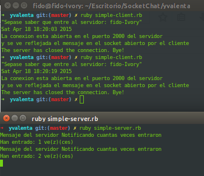

## Example sockets

#### Execute a simple-server

`ruby simple-server.rb`

> Open a TCP connection in port 2000 and print a message when the socket was able to open

##### Output
Mensaje del servidor Notificando cuantas veces entraron
Han entrado: 1 ve(z)(ces)

#### Execute a Simple Client

`ruby simple-client.rb`

> Show the server hostname, time and message

##### Output
> "Sepase saber que entre al servidor: fido-Ivory"
> Sat Apr 18 18:20:19 2015
> La conexion esta abierta en el puerto 2000 del servidor
> y se ve reflejada el mensaje en el socket abierto por el cliente
> The server has closed the connection. Bye!

